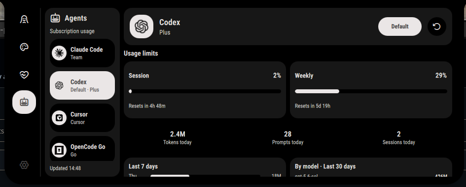
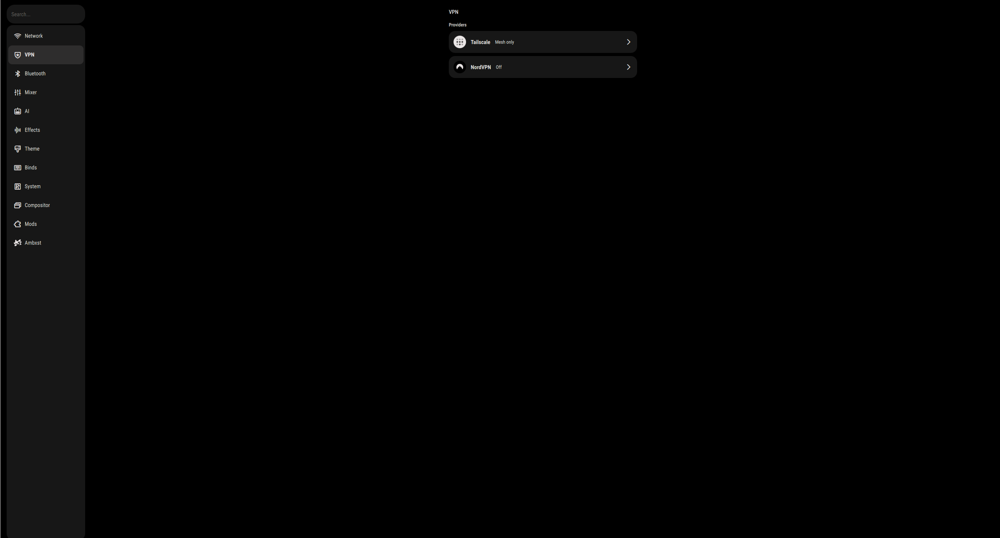

# ambxst-mods

Mods for [Ambxst](https://github.com/Axenide/Ambxst) 1.3+, packaged for its native
mod manager. Each folder under `packages/` is one installable package.

## Installing

Paste a package link into **Settings → Mods** and press *Install*:

```
https://github.com/AspectHeat/ambxst-mods/tree/main/packages/vpn-settings
```

Or from a terminal:

```bash
ambxst mods install https://github.com/AspectHeat/ambxst-mods/tree/main/packages/vpn-settings
ambxst mods enable aspect.vpn-settings
ambxst reload
```

Packages install disabled. Enabling shows the author, license and permissions,
builds a fresh source tree, and takes effect on the next `ambxst reload`. A
failed build never touches the running shell.

## Packages

| Package | ID | What it does |
|---|---|---|
| [vpn-settings](packages/vpn-settings) | `aspect.vpn-settings` | Tailscale and NordVPN pages in Settings, provider handoff, and an optional Tailscale tray item |
| [agent-usage-panel](packages/agent-usage-panel) | `aspect.agent-usage-panel` | A dashboard tab showing token usage, plan limits and reset windows for locally installed coding agents |

More packages can be added as features are ported from the long-running Ambxst fork.

## Screenshots

### Agent usage panel



### VPN settings



### NordVPN


### Tailscale

Network addresses, DNS details, device names and other fleet information are
redacted in this screenshot.


## License

MIT. See [LICENSE](LICENSE).
