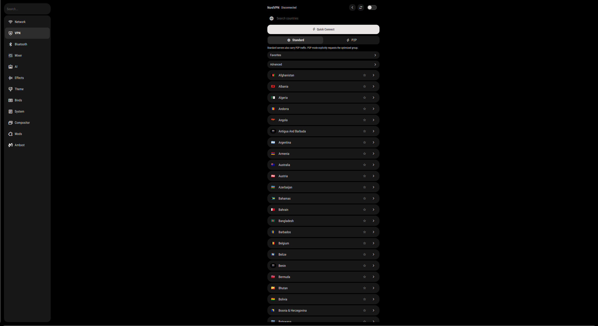
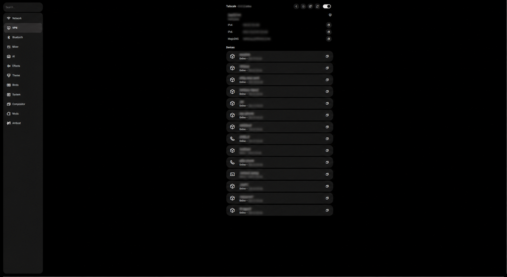

# VPN settings

Adds a VPN section to Ambxst Settings with Tailscale and NordVPN pages, a
provider handoff for moving the default route between them, and an optional
Tailscale item in the bar tray.


<p>

</p>

<p>

</p>

The Tailscale screenshot has network addresses, DNS details, device names and
other fleet information redacted.

## Install

```text
https://github.com/AspectHeat/ambxst-mods/tree/main/packages/vpn-settings
```

Paste that into **Settings → Mods**, or:

```bash
ambxst mods install https://github.com/AspectHeat/ambxst-mods/tree/main/packages/vpn-settings
ambxst mods enable aspect.vpn-settings
ambxst reload
```

Packages install disabled. Enabling builds a fresh source tree and takes effect
on the next `ambxst reload`. A failed build never touches the running shell.

## Requirements

Install the `tailscale` and `nordvpn` CLIs for the respective pages. Each
provider is independent, so one page works without the other installed.

Works with Ambxst `>=1.3.0 <1.4.0`.

## Permissions

This mod runs the Tailscale and NordVPN CLIs with your user permissions. Read
the [manifest](ambxst.mod.json) before enabling it.

## License

MIT.
